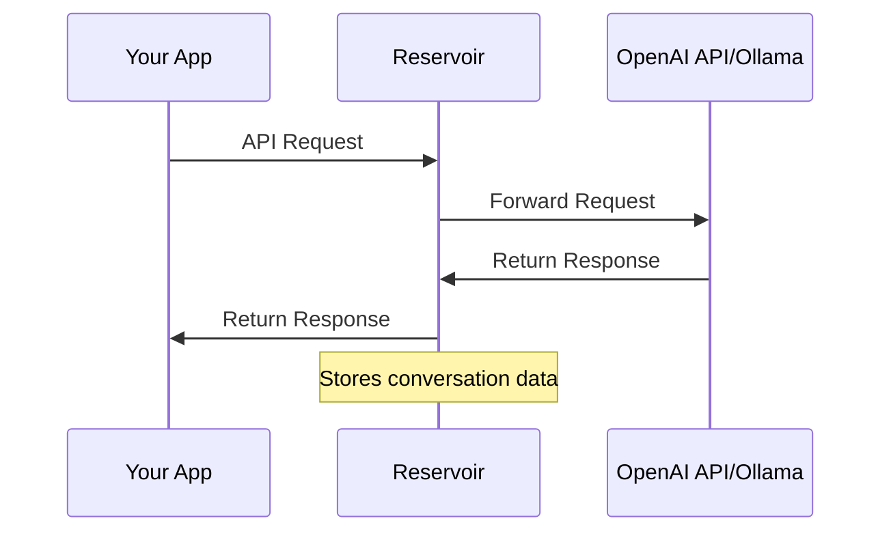

# ⚠️ UNDER CONSTRUCTION ⚠️
This project is currently under active development and is not ready for production use. Features may be incomplete or subject to significant changes.

# reservoir

Reservoir acts as a transparent proxy in front of any OpenAI-compatible API endpoint. Every conversation you have with language models is captured and stored, transforming your 
Reservoir into a living knowledge base that automatically grows with each interaction you make, whether you're chatting, prompting, or coding.

<image width="256" src="./docs/logo.png" />

## Why?

Think of Reservoir as your personal neural lake:  
- 🗂️ Capture: Every query and response is archived for future use.
- 🔎 Search & Fetch: Effortlessly retrieve past prompts and answers by topic, keyword, or context.
- ⚡ Self-building: The more you interact, the smarter and richer your Reservoir becomes.
- 🔩 Plug-n-play: Drop it in as a gateway and make any OpenAI-powered app on your machine start building knowledge, automagically.

## How Does It Work?

Reservoir sits between your client app and the actual OpenAI API:


- **Proxy**: Behaves just like the real API to your apps.
- **Recorder**: Stores all inbound/outbound traffic—questions, answers, metadata, you name it!
- **Knowledge Base**: Over time, Reservoir becomes your own private ChatGPT history, supercharged with search and retrieval.

## Features

- 📖 Full logging & history search
- 🔌 Compatible with OpenAI API clients (Both OpenAI and Ollama)

## Data Model

### Trace IDs & Partitions

Reservoir organizes your conversational data using two key concepts:

- **Trace ID**: A unique identifier automatically generated for each API request. This allows you to track and retrieve the complete history of a specific conversation or API call. Every message exchanged in a single request-response cycle shares the same trace ID.

- **Partition**: An optional user-defined namespace that allows you to logically separate your message history. You specify a partition as part of the URL path when making requests to Reservoir, for example:
  ```
  http://localhost:3017/v1/chat/completions/project-x
  ```
  
  Where `project-x` is your partition name. This makes it easy to organize conversations by:
  - Project scope
  - User identity
  - Application source
  - Custom categories

Partitioning gives you flexible control over how your knowledge base is structured and queried, letting you maintain separate conversational histories for different contexts.
