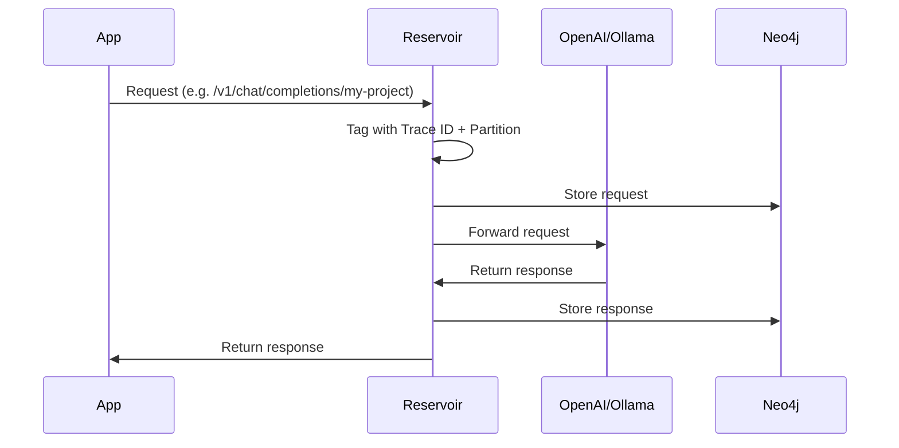
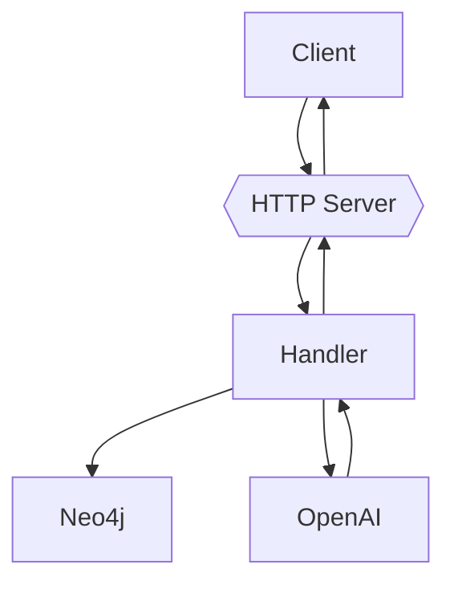

# ⚠️ Under Construction

> Reservoir is in active development. It’s not ready for production use yet. Expect breaking changes.

# 🧠 Reservoir

Reservoir is a transparent proxy for any OpenAI-compatible API. It captures all your AI conversations and stores them in a Neo4j graph, turning every interaction into a searchable, self-growing knowledge base.

<p align="center"></p>

## 💡 Why Reservoir?

Think of it as a personal neural lake:
- 🗂️ **Capture**: Every prompt and response is logged.
- 🔍 **Search (coming soon)**: Look up past queries by topic, keyword, or context.
- ⚡ **Self-building**: Your interactions enrich the system.
- 🔌 **Plug-and-Play**: Drop it in front of your OpenAI-compatible app—no client code changes needed.

## 🔧 How It Works

Reservoir sits between your app and the actual LLM service (OpenAI, Ollama, etc.):



## 🔍 Features

- 📖 Logs all request/response traffic
- 🔌 OpenAI-compatible
- 🏷️ Partitioning via URL path (group by project or app)
- 🗖️ Traceable interactions with unique request IDs
- 🔸 Stored in Neo4j for rich graph querying

## 🚀 Getting Started (Development Setup)

Reservoir is currently intended for local development use. You’ll run the app manually, but we provide a `docker-compose.yml` file to spin up the Neo4j database easily.

### Step 1: Clone the Repository

```bash
git clone https://github.com/yourname/reservoir
cd reservoir
```

### Step 2: Start Neo4j with Docker Compose

```bash
docker-compose up -d
```

This starts Neo4j on the default `bolt://localhost:7687`.

### Step 3: Set Environment Variables

Create a `.env` file or export the following in your shell:

```env
RESERVOIR_PORT=3017
OPENAI_API_KEY=sk-...
NEO4J_URI=bolt://localhost:7687
NEO4J_USER=neo4j
NEO4J_PASSWORD=password
```

### Step 4: Run Reservoir

```bash
cargo run
```

Reservoir will now listen on `http://localhost:3017`.

## 🧠 Usage

Change your API URL to point at Reservoir:

- **Instead of**:  
  `https://api.openai.com/v1/chat/completions`
- **Use**:  
  `http://localhost:3017/v1/chat/completions/your-partition`

`your-partition` can be any string you use to group conversations (like `my-app`, `project-x`, etc).

## 🏗️ Architecture



## 💃️ Storage Model

Conversations are stored in Neo4j as:

- **Nodes** (`MessageNode`): One per message (user/AI)
  - `trace_id`, `partition`, `role`, `content`, `timestamp`
- **Trace ID**: Unique per request/response pair
- **Partition**: Logical namespace from the request URL

## ⚙️ Config Options

Set via environment variables:

| Variable         | Description                       | Default                 |
|------------------|-----------------------------------|--------------------------|
| `RESERVOIR_PORT` | Port to serve HTTP requests       | `3017`                  |
| `OPENAI_API_KEY` | API key for forwarding            | *(Required)*            |
| `NEO4J_URI`      | Neo4j DB connection URI           | `bolt://localhost:7687` |
| `NEO4J_USER`     | Neo4j username                    | `neo4j`                 |
| `NEO4J_PASSWORD` | Neo4j password                    | `password`              |

