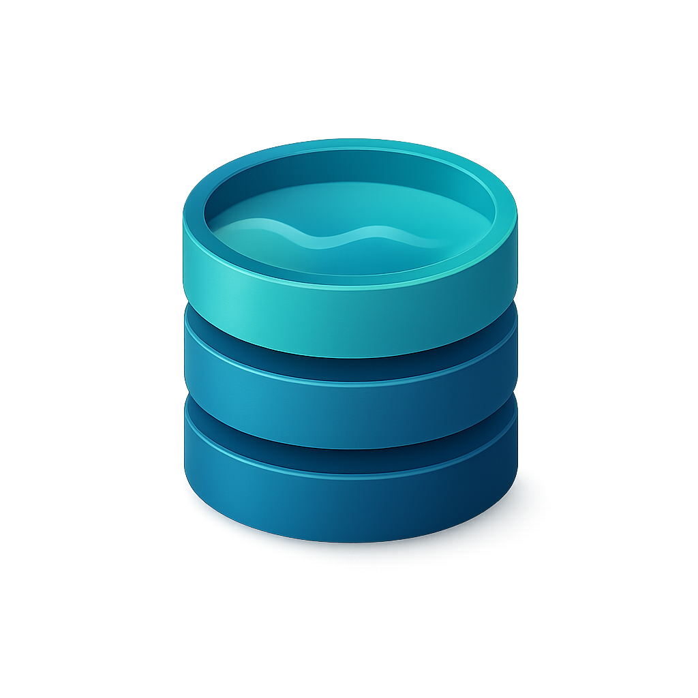
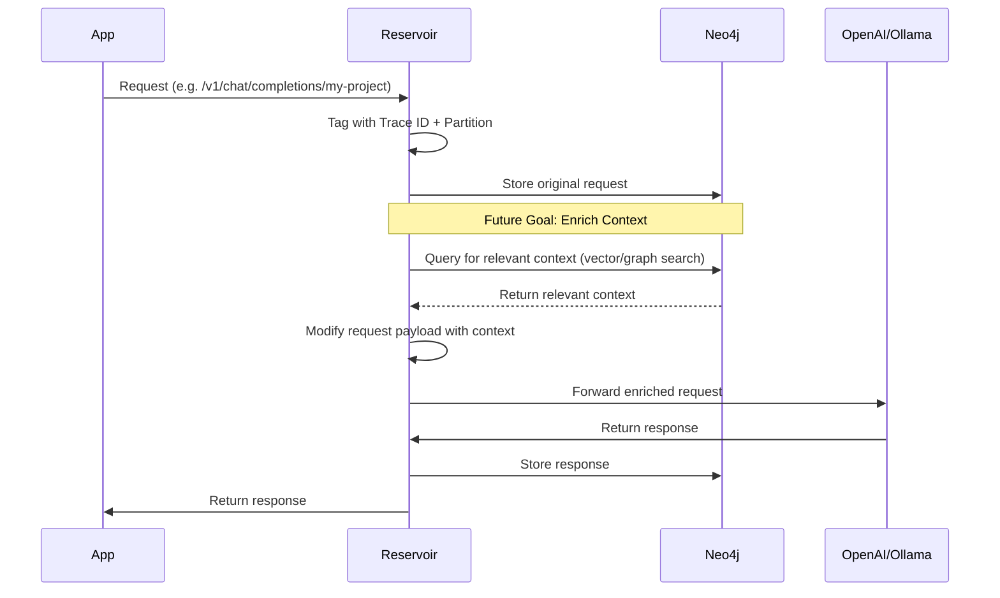
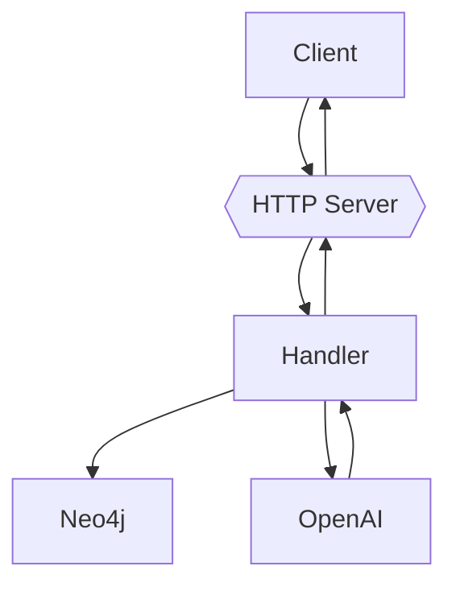

# ⚠️ Under Construction

> Reservoir is in active development. It’s not ready for production use yet. Expect breaking changes.

# 🧠 Reservoir

Reservoir is a transparent proxy for any OpenAI-compatible API. It captures all your AI conversations and stores them in a Neo4j graph, turning every interaction into a searchable, self-growing knowledge base.

<p align="center"></p>

## 💡 Why Reservoir?

Think of it as a personal neural lake that evolves into an intelligent assistant with memory:
- 🗂️ **Capture**: Every prompt and response is logged, building a rich history.
- 🧠 **Dynamic Context Enrichment (Future Goal)**: The core idea is to leverage Neo4j's graph relationships and vector search capabilities. Reservoir aims to dynamically build relevant context from your past interactions (based on semantic similarity and graph connections) and inject it into new prompts *before* they are sent to the AI model. This enrichment provides a seamless experience, making it feel like you're talking to an AI with persistent memory.
- 🔍 **Search (coming soon)**: Look up past queries by topic, keyword, or context, powered by standard and semantic search.
- ⚡ **Self-building**: Your interactions continuously enrich the knowledge base.
- 🔌 **Plug-and-Play**: Drop it in front of your OpenAI-compatible app—no client code changes needed.

## 🔧 How It Works

Reservoir sits between your app and the actual LLM service (OpenAI, Ollama, etc.):



## 🔍 Features

- 📖 Logs all request/response traffic
- 🔌 OpenAI-compatible
- 🏷️ Partitioning via URL path (group by project or app)
- 🗖️ Traceable interactions with unique request IDs
- 🔸 Stored in Neo4j for rich graph querying
- 💡 **Future**: Plans to utilize Neo4j vector search for semantic retrieval.

## 🚀 Getting Started (Development Setup)

Reservoir is currently intended for local development use. You’ll run the app manually, but we provide a `docker-compose.yml` file to spin up the Neo4j database easily.

### Step 1: Clone the Repository

```bash
git clone https://github.com/yourname/reservoir
cd reservoir
```

### Step 2: Start Neo4j with Docker Compose

```bash
docker-compose up -d
```

This starts Neo4j on the default `bolt://localhost:7687`.

### Step 3: Set Environment Variables

Create a `.env` file or export the following in your shell:

```env
RESERVOIR_PORT=3017
OPENAI_API_KEY=sk-...
NEO4J_URI=bolt://localhost:7687
NEO4J_USER=neo4j
NEO4J_PASSWORD=password
```

### Step 4: Run Reservoir

```bash
cargo run
```

Reservoir will now listen on `http://localhost:3017`.

## 🧠 Usage

To use Reservoir, simply change the API endpoint URL in your client application or scripts to point to the Reservoir server instead of the direct OpenAI API URL. Make sure to include a partition name in the path.

**Example:**

-   **Instead of**:
    `https://api.openai.com/v1/chat/completions`
-   **Use**:
    `http://localhost:3017/v1/chat/completions/your-partition`

Here, `your-partition` can be any string you choose to group related conversations (e.g., `my-app`, `project-x`, `user123`).

### Curl Example

Here's how you would make a request using `curl`, mirroring the standard OpenAI API format but targeting Reservoir:

```sh
curl "http://localhost:3017/v1/partition/curl/instance/$USER/chat/completions" \
    -H "Content-Type: application/json" \
    -H "Authorization: Bearer $OPENAI_API_KEY" \
    -d '{
        "model": "gpt-4",
        "messages": [
            {
                "role": "user",
                "content": "Write a one-sentence bedtime story about a brave little toaster."
            }
        ]
    }'
```

### Python Example (using `openai` library)

If you're using the official `openai` Python library, you just need to configure the `base_url` when initializing the client:

```python
import os
from openai import OpenAI

client = OpenAI(
    base_url="http://localhost:3017/v1/partition/my-python-app",
    api_key=os.environ.get("OPENAI_API_KEY")
)

completion = client.chat.completions.create(
    model="gpt-4",
    messages=[
        {
            "role": "user",
            "content": "Write a one-sentence bedtime story about a curious robot."
        }
    ]
)
print(completion.choices[0].message.content)
```

**Note:** The request structure (headers, body) is identical to a direct OpenAI call. The only changes are:
1.  The **URL** points to your Reservoir instance (`http://localhost:3017`).
2.  The **path** includes your chosen partition (`/v1/chat/completions/my-partition`).

Reservoir will handle forwarding the request (including the `Authorization` header) to the actual OpenAI API and store the conversation under the specified partition.

## 🏗️ Architecture



## 💃️ Storage Model

Conversations are stored in Neo4j as:

- **Nodes** (`MessageNode`): One per message (user/AI)
  - `trace_id`, `partition`, `role`, `content`, `timestamp`
- **Trace ID**: Unique per request/response pair
- **Partition**: Logical namespace from the request URL

Neo4j is chosen specifically for its graph capabilities, which allow modeling the relationships *between* conversations and messages, and its potential to leverage built-in vector search features. This combination is key to the future goal of dynamically building and enriching prompt contexts based on semantic understanding and historical connections, effectively giving the AI a searchable memory.

## ⚙️ Config Options

Set via environment variables:

| Variable         | Description                       | Default                 |
|------------------|-----------------------------------|--------------------------|
| `RESERVOIR_PORT` | Port to serve HTTP requests       | `3017`                  |
| `OPENAI_API_KEY` | API key for forwarding            | *(Required)*            |
| `NEO4J_URI`      | Neo4j DB connection URI           | `bolt://localhost:7687` |
| `NEO4J_USER`     | Neo4j username                    | `neo4j`                 |
| `NEO4J_PASSWORD` | Neo4j password                    | `password`              |

