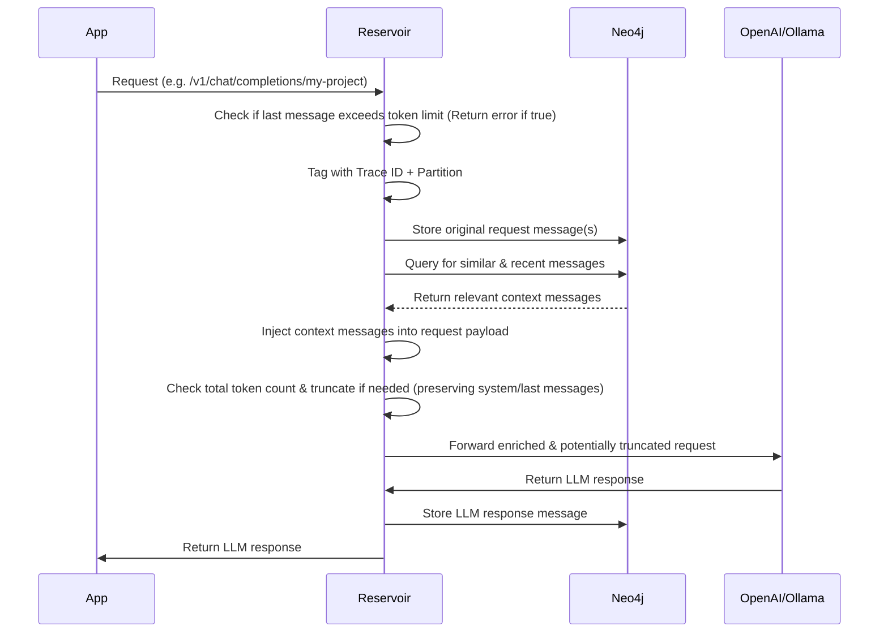
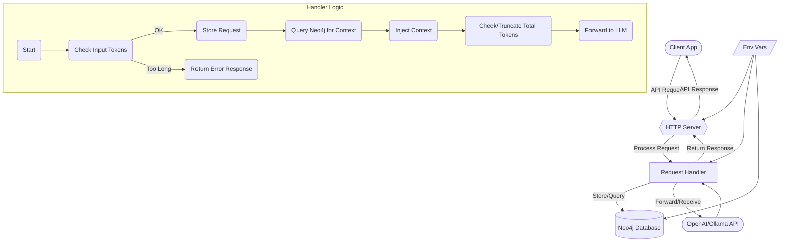

# ⚠️ Under Construction

> Reservoir is in active development. It’s not ready for production use yet. Expect breaking changes.

# 🧠 Reservoir

Reservoir is a transparent proxy for any OpenAI-compatible API. It captures all your AI conversations and stores them in a Neo4j graph, turning every interaction into a searchable, self-growing knowledge base.

<p align="center"></p>

## 💡 Why Reservoir?

Think of it as a personal neural lake that evolves into an intelligent assistant with memory:
- 🗂️ **Capture**: Every prompt and response is logged, building a rich history.
- 🧠 **Dynamic Context Enrichment**: Automatically adds relevant past conversations to new prompts, giving the AI a memory-like experience. Leverages Neo4j's graph relationships and vector search to inject semantically similar messages from your history.
- 🔍 **Search (coming soon)**: Look up past queries by topic, keyword, or context, powered by standard and semantic search.
- ⚡ **Self-building**: Your interactions continuously enrich the knowledge base.
- 🔌 **Plug-and-Play**: Drop it in front of your OpenAI-compatible app—no client code changes needed.

## 🔧 How It Works

Reservoir intercepts your API calls, enriches them with relevant history, manages token limits, and then forwards them to the actual LLM service.



- **Intercept & Validate**: Receives the request, checks basic validity (like input token limits).
- **Store Request**: Logs the incoming user message(s) to Neo4j.
- **Enrich Context**: Queries Neo4j for semantically similar and recent messages within the same partition/instance and injects them into the request's message list.
- **Manage Tokens**: Calculates the total token count of the enriched request. If it exceeds the limit (`MAX_TOKENS`), it removes older non-system messages until it fits.
- **Forward**: Sends the final, potentially modified request to the upstream LLM API.
- **Store Response**: Logs the LLM's response message to Neo4j.
- **Return Response**: Sends the original LLM response back to the client application.

## 🔍 Features

- 📖 **Logging**: Logs all request/response traffic (user & assistant messages) to Neo4j.
- 🔌 **Compatibility**: OpenAI-compatible API endpoint.
    - **Note**: Currently, **streaming responses are not supported**. All requests are handled in a non-streaming manner.
    - Tested primarily with `curl`, the `openai` Python library, and [Chat Gipitty](https://github.com/divanvisagie/chat-gipitty) (for which Reservoir was initially designed as a memory system). Compatibility with other clients may vary.
- 🏷️ **Partitioning & Instancing**: Organize conversations via URL path using `partition` and `instance` (e.g., `/v1/partition/{partition}/instance/{instance}/chat/completions`).
- 🔗 **Traceability**: Unique trace ID for each request/response cycle.
- 🧠 **Context Enrichment**: Automatically injects relevant past messages (semantically similar and recent within the same partition/instance) into the prompt context.
- ✂️ **Token Management**:
    - Checks if the user's input message exceeds the token limit and returns an error.
    - Automatically truncates the enriched message history (preserving system prompts and the latest user message) if it exceeds the model's context window limit.
- 💾 **Graph Storage**: Uses Neo4j, enabling rich querying and future relationship analysis.
- 💡 **Future**: Plans to refine context enrichment using advanced graph algorithms and vector search.

## 🚀 Getting Started (Development Setup)

Reservoir is currently intended for local development use. You’ll run the app manually, but we provide a `docker-compose.yml` file to spin up the Neo4j database easily.

### Step 1: Clone the Repository

```bash
git clone https://github.com/yourname/reservoir
cd reservoir
```

### Step 2: Start Neo4j with Docker Compose

```bash
docker-compose up -d
```

This starts Neo4j on the default `bolt://localhost:7687`.

### Step 3: Set Environment Variables

Create a `.env` file or export the following in your shell:

```env
RESERVOIR_PORT=3017
OPENAI_API_KEY=sk-...
NEO4J_URI=bolt://localhost:7687
NEO4J_USER=neo4j
NEO4J_PASSWORD=password
```

### Step 4: Run Reservoir

```bash
cargo run
```

Reservoir will now listen on `http://localhost:3017`.

## 🧠 Usage

To use Reservoir, change the API endpoint URL in your client application or scripts to point to the Reservoir server, including both a `partition` and an `instance` name in the path.

**URL Structure:**

`/v1/partition/{partition}/instance/{instance}/chat/completions`

-   `{partition}`: A broad category (e.g., project name, application name).
-   `{instance}`: A specific context within the partition (e.g., user ID, session ID, specific feature).

**Example:**

-   **Instead of**:
    `https://api.openai.com/v1/chat/completions`
-   **Use**:
    `http://localhost:3017/v1/partition/my-project/instance/user123/chat/completions`

Here, `my-project` is the partition, and `user123` is the instance. Context enrichment and history retrieval are scoped to the specific `partition`/`instance` combination.

### Curl Example

```bash
# Ensure OPENAI_API_KEY is set
# Replace 'my-project' and 'user-session-abc' with your values

curl http://localhost:3017/v1/partition/my-project/instance/user-session-abc/chat/completions \
    -H "Content-Type: application/json" \
    -H "Authorization: Bearer $OPENAI_API_KEY" \
    -d '{
        "model": "gpt-4",
        "messages": [
            {
                "role": "user",
                "content": "Write a one-sentence bedtime story about a brave little toaster."
            }
        ]
    }'
```

### Python Example (using `openai` library)

Configure the `base_url` to include both partition and instance.

```python
import os
from openai import OpenAI

# Replace with your partition and instance
PARTITION = "my-python-app"
INSTANCE = "main-thread"
RESERVOIR_PORT = os.getenv('RESERVOIR_PORT', '3017')

# Construct the base URL dynamically
RESERVOIR_BASE_URL = f"http://localhost:{RESERVOIR_PORT}/v1/partition/{PARTITION}/instance/{INSTANCE}"

client = OpenAI(
    base_url=RESERVOIR_BASE_URL,
    api_key=os.environ.get("OPENAI_API_KEY")
)

completion = client.chat.completions.create(
    model="gpt-4",
    messages=[
        {
            "role": "user",
            "content": "Write a one-sentence bedtime story about a curious robot."
        }
    ]
)
print(completion.choices[0].message.content)
```

**Note:**
- The request structure (headers, body) remains identical to a direct OpenAI call.
- The **URL** points to Reservoir (`http://localhost:3017`).
- The **path** now includes `/v1/partition/{partition}/instance/{instance}/chat/completions`.
- Context enrichment and history lookups are scoped to the specific `partition` and `instance` provided in the URL.
- Input token limit checks and automatic truncation still apply.

Reservoir forwards the request (including `Authorization`) to OpenAI and stores the conversation tagged with the specified `partition` and `instance`.

## 💃️ Storage Model

Conversations are stored in Neo4j as:

- **Nodes** (`MessageNode`): One per message (user/AI)
  - `trace_id`, `partition`, `instance`, `role`, `content`, `timestamp`, `embedding` (optional)
- **Trace ID**: Unique per request/response pair
- **Partition**: Logical namespace from the request URL (e.g., project, app)
- **Instance**: Specific context within a partition from the URL (e.g., user, session)

Neo4j is chosen specifically for its graph capabilities, which allow modeling the relationships *between* conversations and messages, and its potential to leverage built-in vector search features. This combination is key to the future goal of dynamically building and enriching prompt contexts based on semantic understanding and historical connections, effectively giving the AI a searchable memory.

## 🏗️ Architecture



### Core Components

1.  **Client Application**: Your application making API calls.
2.  **HTTP Server (Hyper/Tokio)**: Receives requests, routes based on URL path (`/v1/partition/{partition}/instance/{instance}/chat/completions`).
3.  **Request Handler**:
    *   Validates incoming request (checks last message token size).
    *   Assigns Trace ID, extracts **Partition** and **Instance** from the URL path.
    *   Stores incoming messages in Neo4j (tagged with partition/instance).
    *   Queries Neo4j for relevant historical context (similar & recent messages *within the same partition/instance*).
    *   **Enriches** the request's message list with retrieved context.
    *   **Truncates** the enriched message list if it exceeds `MAX_TOKENS`, preserving system/latest messages.
    *   Forwards the final request payload to the upstream LLM.
    *   Stores the LLM response message in Neo4j (tagged with partition/instance).
    *   Returns the LLM response to the client.
4.  **Neo4j Database**: Stores `MessageNode`s with `partition` and `instance` properties.
5.  **OpenAI/Ollama API**: External LLM service.
6.  **Environment Variables**: Configuration.

## ⚙️ Configuration Options

Reservoir is configured via environment variables:

-   `RESERVOIR_PORT`: Port for Reservoir to listen on (Default: `3017`).
-   `OPENAI_API_KEY`: Your OpenAI API key (or compatible key for other services) required for forwarding requests.
-   `NEO4J_URI`: Connection URI for the Neo4j database (Default: `bolt://localhost:7687`).
-   `NEO4J_USER`: Neo4j username (Default: `neo4j`).
-   `NEO4J_PASSWORD`: Neo4j password (Default: `password`).
-   `MAX_TOKENS`: (Optional, defaults internally) The maximum token limit used for truncation checks.

*(Consider adding other relevant variables like embedding model endpoint if configurable)*

## 🤝 Contributing

*(Placeholder: Add contribution guidelines - e.g., code style, pull request process, setting up dev environment)*

Contributions are welcome! Please open an issue or submit a pull request.

## 📜 License

This project is licensed under the Apache License 2.0 - see the [LICENSE](LICENSE) file for details.

