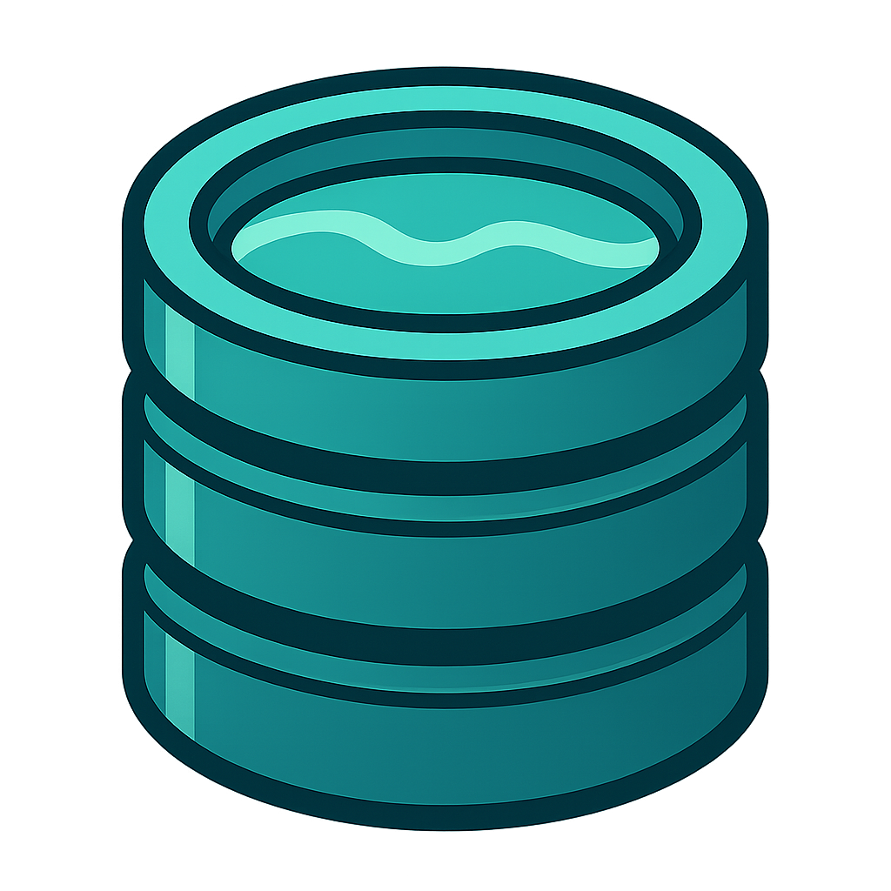
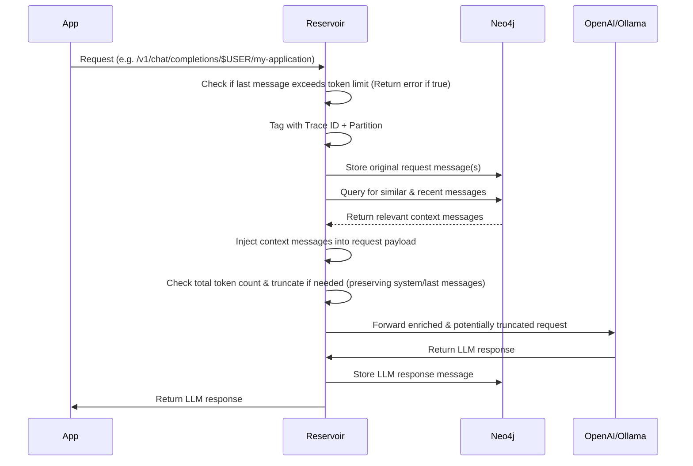
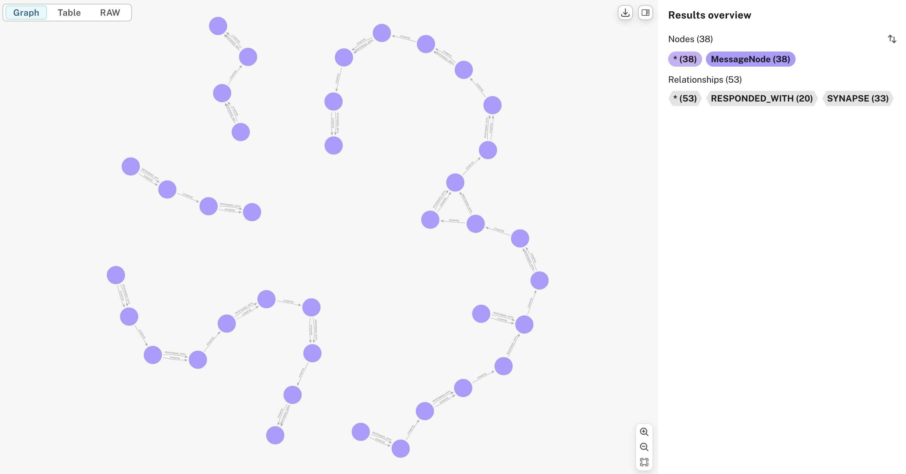

# 🚧 Under Construction

> Reservoir is in active development. It’s not ready for production use yet. Expect breaking changes.

# Reservoir

Reservoir is a transparent proxy for any OpenAI-compatible API. It captures all your AI conversations and stores them in a Neo4j graph, turning every interaction into a searchable, self-growing knowledge base.

<p align="center"></p>

## Table of Contents
- [Overview](#overview)
- [Quick Start](#quick-start)
- [Conversation Threads via Synapses](#conversation-threads-via-synapses)
- [Documentation](#documentation)
- [License](#license)

## Overview
Reservoir intercepts your API calls, enriches them with relevant history, manages token limits, and then forwards them to the actual LLM service.



This sequence diagram provides a high-level overview of how Reservoir processes requests and responses.

## Quick Start

Reservoir provides an OpenAI-compatible API endpoint. You can use your system username as the partition and your application name as the instance for best results.

### Example Usage
- **Instead of**:
  `https://api.openai.com/v1/chat/completions`
- **Use**:
  `http://localhost:3017/v1/partition/$USER/instance/my-application/chat/completions`

Here, `$USER` is the system username, and `my-application` is the instance. Context enrichment and history retrieval are scoped to the specific `partition`/`instance` combination.

#### Curl Example
```bash
curl http://localhost:3017/v1/partition/$USER/instance/my-application/chat/completions \
    -H "Content-Type: application/json" \
    -H "Authorization: Bearer $OPENAI_API_KEY" \
    -d '{
        "model": "gpt-4",
        "messages": [
            {
                "role": "user",
                "content": "Write a one-sentence bedtime story about a brave little toaster."
            }
        ]
    }'
```

#### Python Example (using `openai` library)
```python
import os
from openai import OpenAI

INSTANCE = "my-application"
PARTITION = os.getenv("USER")
RESERVOIR_PORT = os.getenv('RESERVOIR_PORT', '3017')
RESERVOIR_BASE_URL = f"http://localhost:{RESERVOIR_PORT}/v1/partition/{PARTITION}/instance/{INSTANCE}"

client = OpenAI(
    base_url=RESERVOIR_BASE_URL,
    api_key=os.environ.get("OPENAI_API_KEY")
)

completion = client.chat.completions.create(
    model="gpt-4",
    messages=[
        {
            "role": "user",
            "content": "Write a one-sentence bedtime story about a curious robot."
        }
    ]
)
print(completion.choices[0].message.content)
```

## Conversation Threads via Synapses

Reservoir uses synapse relationships to create “threads” of semantically related messages within the conversation graph. As messages are added, synapses link them sequentially, forming a continuous flow. When the similarity between messages drops below a threshold, the thread is split, marking a topic change. This results in distinct conversation threads, making it easy to visualize and retrieve related exchanges.

You can see an example of this structure in the following graph visualization:



## Documentation

Reservoir's documentation is organized into the following sections:
- [Architecture](./docs/architecture.md): System and component overview.
- [API](./docs/api.md): API endpoints, usage, and examples.
- [Data Model](./docs/data_model.md): How data is stored in Neo4j, including the schema.
- [Development](./docs/dev.md): Setting up the development environment, running locally, and contributing.
- [Features](./docs/features.md): Key features and future roadmap.
- [Deployment](./docs/deployment.md): Steps to deploy Reservoir locally or in production.
- [FAQ](./docs/faq.md): Troubleshooting, common questions, and tips.

## License

This project is licensed under the Apache License 2.0 - see the [LICENSE](LICENSE) file for details.

