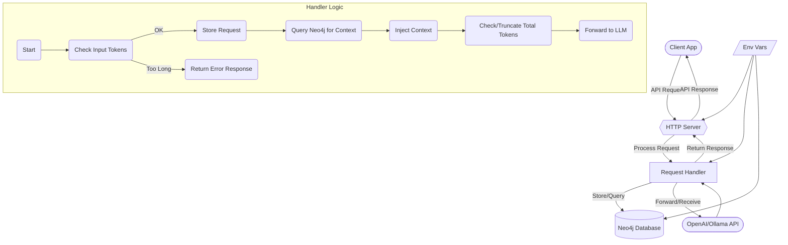

# Architecture

Reservoir is designed as a transparent proxy for OpenAI-compatible APIs, with a focus on capturing and enriching AI conversations. Below is an updated overview of its architecture:

## Core Components

1. **Client Application**: Your application making API calls.
2. **HTTP Server (Hyper/Tokio)**: Receives requests, routes based on URL path (`/v1/partition/{partition}/instance/{instance}/chat/completions`).
3. **Request Handler**:
    - Validates incoming request (checks last message token size).
    - Assigns Trace ID, extracts **Partition** and **Instance** from the URL path.
    - Stores incoming messages in Neo4j (tagged with partition/instance).
    - Queries Neo4j for relevant historical context (similar & recent messages *within the same partition/instance*).
    - **Enriches** the request's message list with retrieved context.
    - **Truncates** the enriched message list if it exceeds `MAX_TOKENS`, preserving system/latest messages.
    - Forwards the final request payload to the upstream LLM.
    - Stores the LLM response message in Neo4j (tagged with partition/instance).
    - Returns the LLM response to the client.
    - **Connect Synapses**: Links semantically similar messages using vector similarity and removes weak connections (score < 0.85).
4. **Neo4j Database**: Stores `MessageNode`s with `partition` and `instance` properties. Supports vector-based similarity search and graph relationships.
5. **OpenAI/Ollama API**: External LLM service.
6. **Environment Variables**: Configuration.